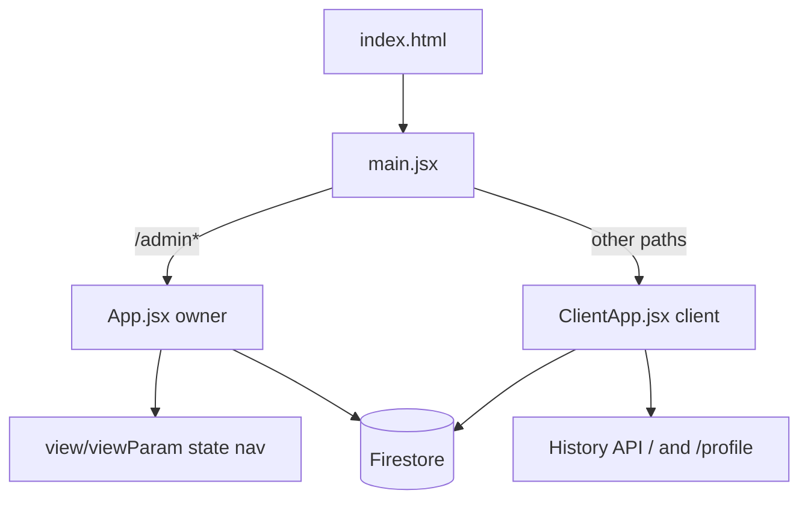

# HandyJob — Technical Summary

HandyJob is a Vite + React 18 single-page application for a small handyman/trade business. It provides an owner dashboard for job management and a client-facing booking flow. Both surfaces share one Firebase project (`handyjob-d3464`), one build bundle, and the same Auth/Firestore instances.

---

## Tech Stack

| Layer | Technology |
|-------|------------|
| Frontend | React 18, Vite 6, inline styles (no CSS framework) |
| Auth & data | Firebase Auth, Firestore |
| Hosting | Firebase Hosting (Classic), SPA rewrites |
| Functions | Node 24, TypeScript (`functions/src/`) |
| PWA | `manifest.webmanifest`, service worker (`public/sw.js`) |

**npm scripts** (`package.json`):

| Script | Command |
|--------|---------|
| `dev` | `vite` |
| `build` | `vite build` → `dist/` |
| `preview` | `vite preview` |
| `deploy` | `build` + `firebase deploy --only hosting` |
| `set-owner-claim` | `node scripts/setOwnerClaim.mjs` |

**Vite config** (`vite.config.js`): `@vitejs/plugin-react`, `appType: "spa"`, React dedupe aliases. Env var `VITE_RECAPTCHA_SITE_KEY` configures reCAPTCHA Enterprise.

---

## Architecture



There is **no React Router**. Routing is custom and split at two levels:

1. **Top-level** (`src/main.jsx`): pathname `/admin` or `/admin/**` → owner app; everything else → client app.
2. **Owner** (`src/App.jsx`): in-memory `view` + `viewParam` state; URL stays `/admin`.
3. **Client** (`src/components/client/ClientApp.jsx`): History API — `/` → booking, `/profile` → profile; legacy `/book` paths normalized via `replaceState`.

App bootstrap waits for `authRecaptchaReady` (Firebase reCAPTCHA Enterprise init) before mounting. A root error boundary catches render failures. Service worker registers on load.

Firebase Hosting (`firebase.json`) rewrites all routes to `index.html` for client-side routing.

---

## Authentication

| Surface | Hook | Sign-in methods | Access gate |
|---------|------|-----------------|-------------|
| Owner (`/admin`) | `src/hooks/useAuth.js` | Google popup/redirect | `isOwnerFirebaseUser()` — allowlisted email **or** `role: "owner"` custom claim |
| Client (`/`, `/profile`) | `src/hooks/useClientAuth.js` | Phone (SMS + invisible reCAPTCHA), email/password, Google | Any authenticated user; owners redirected to `/admin` |

**Owner eligibility** (`src/auth/isOwnerFirebaseUser.js`):

- Google email matches `ALLOWED_GOOGLE_EMAIL` in `src/constants.js` (Gmail dot/plus normalization via `src/auth/allowlistEmail.js`)
- **OR** ID token custom claim `role === "owner"` (set via `scripts/setOwnerClaim.mjs`; user must re-sign-in)

Non-owners who sign in with Google on `/admin` get a blocked state (`blockedFirebaseUser` set, `user` stays `null`).

**Client phone auth**: `normalizePhoneE164()` → invisible `RecaptchaVerifier` → `signInWithPhoneNumber` → SMS code confirmation.

**Client profile** (`src/hooks/useClientProfile.js`): real-time listener on `clientProfiles/{uid}`; `saveProfile()` merges `displayName`, `address`, `phone`.

**Auth utilities** (`src/auth/`): `initRecaptcha.js`, `phoneNumber.js`, `phoneRecaptcha.js`, `authErrors.js`.

---

## Firestore Data Model

Full field-level schema: [`FIRESTORE_SCHEMA.md`](FIRESTORE_SCHEMA.md).

| Collection | Doc ID | Purpose |
|------------|--------|---------|
| `customers` | auto | Client contact records |
| `jobs` | auto | Work orders: status, pricing, tasks, expenses, pay status |
| `jobs/{jobId}/workSessions` | auto | Billable time tracking (30-min chunk rounding on stop) |
| `tools` | auto | Tool inventory by category |
| `tasks` | auto | Reusable task templates with `toolIds[]` |
| `availability` | auto | Bookable time windows (`open` / `closed`) |
| `bookingRequests` | auto | Client booking requests (`pending` / `approved` / `declined`) |
| `clientProfiles` | `{uid}` | Per-client profile (address, phone, display name) |

**Composite indexes** (`firestore.indexes.json`):

- `availability`: `status` + `start`
- `bookingRequests`: `status` + `requestedStart`; `clientUid` + `requestedStart` (desc)

### Security (`firestore.rules`)

| Collection | Owner | Signed-in client | Anonymous |
|------------|-------|------------------|-----------|
| `customers`, `jobs`, `workSessions`, `tools`, `tasks` | read/write | — | — |
| `availability` | full CRUD | read where `status == "open"` | — |
| `bookingRequests` | read all; update/delete | create (`clientUid == uid`, `status == "pending"`); read own | — |
| `clientProfiles/{userId}` | read all | create/update own doc | — |

Owner check in rules: custom claim `role == "owner"` **or** legacy email regex (must stay aligned with `ALLOWED_GOOGLE_EMAIL`). Cloud Functions use Admin SDK and bypass rules.

---

## Owner App (`/admin`)

`src/App.jsx` is the central data hub. While signed in, it subscribes via `onSnapshot` to: `customers`, `jobs`, `tools`, `tasks`, `availability`, `bookingRequests`. All page components receive a shared `ctx` object (data, `nav`, CRUD helpers, derived metrics).

### Navigation views

| View key | Component |
|----------|-----------|
| `dashboard` | `Dashboard.jsx` |
| `customers` | `Customers.jsx` |
| `newCustomer` | `NewCustomer.jsx` |
| `customer/:id` | `CustomerDetail.jsx` |
| `jobs` | `Jobs.jsx` |
| `newJob` | `NewJob.jsx` |
| `job/:id` | `JobDetail.jsx` |
| `tools` | `ToolsManager.jsx` |
| `tasks` | `TasksManager.jsx` |
| `scheduling` | `SchedulingManager.jsx` |

### Dashboard (`Dashboard.jsx`)

KPI cards: total revenue, costs, profit, customer/job counts. Lists upcoming jobs (Scheduled or In Progress, sorted by date).

Revenue/cost aggregates computed in `App.jsx` over Complete jobs only:

- `jobRevenue(job)` = flat `price` + `hourlyRate × hours`
- `jobCostBreakdown(job)` = task materials + job expenses (reimbursable vs non-reimbursable split)

### Job detail (`JobDetail.jsx`)

Tabbed workspace:

| Tab | Component | Function |
|-----|-----------|----------|
| Details | `JobDetailsTab.jsx` | Core fields, revenue/cost/profit cards, work session timer |
| Tasks | `TasksTab.jsx` | Per-job checklist from templates |
| Expenses | `ExpensesTab.jsx` | Job-level expenses |
| Checklist | `ChecklistTab.jsx` | Packing list aggregated from task tools and materials |
| Invoice | `InvoiceTab.jsx` | Payment / invoice view |

**Work sessions** (`jobs/{jobId}/workSessions`): start creates doc with `endMs: null`; stop computes billable time in 30-minute floor chunks and adds `billableHours` to job `hours`.

### Tools & tasks

- **`ToolsManager.jsx`**: add tools individually or bulk from `RECOMMENDED_TOOLS` in `src/toolCatalog.js` (~75 tools across 8 categories). On first owner login with empty `tools` collection, `App.jsx` auto-seeds recommended tools. Delete cascades: removes tool ID from affected task template `toolIds`.
- **`TasksManager.jsx`** + **`TaskEditor.jsx`**: manage reusable task templates in `tasks` collection.

### Scheduling (`SchedulingManager.jsx`)

**Availability management**:

- Create time windows with slot length (min 15 min); large windows split into individual Firestore docs via `splitTimeWindowIntoSlotChunks` (e.g. 10:00–22:00 at 60-min slots → 12 docs)
- Repeat-through date with weekday filter; copy pattern across date ranges
- Toggle `open` ↔ `closed` (clients only see `open`)
- Batch writes (400 docs/batch)

**Booking requests**:

- Sorted table of all `bookingRequests`
- Approve / decline → update `status`
- **Create job** → `createJobFromBookingRequest` in `App.jsx`: match customer by normalized phone (10+ digits) or create new customer, create `jobs` doc (Scheduled, links `sourceBookingRequestId` and `bookingClientUid`), set `bookingRequests.linkedJobId`, navigate to job detail

### Other owner UI

- **`SignInScreen.jsx`**: Google sign-in for owners
- Dark nav bar with `NavIcon` SVG tabs; mobile horizontal scroll + hamburger account menu
- Toast notifications (2.5s, fixed bottom)

---

## Client App (`/`, `/profile`)

Shell: `src/components/client/ClientApp.jsx`. Redirects signed-in owners to `/admin`. Two-tab nav: "Request time" | "Profile".

| Component | Purpose |
|-----------|---------|
| `ClientSignIn.jsx` | Multi-method auth UI (phone default, email/password, Google) |
| `ClientBookingFlow.jsx` | Two-step booking: job details → slot selection |
| `ClientProfile.jsx` | Edit `clientProfiles/{uid}`; view own booking history |

### Booking flow (`ClientBookingFlow.jsx`)

**Step 1 — Details**: title, location, phone, notes (prefilled from client profile).

**Step 2 — Time selection**:

1. Real-time query: `availability` where `status == "open"`, ordered by `start`
2. `expandSlots()` splits each availability doc into bookable sub-slots
3. Filter to future slots; group by day and contiguous runs
4. Range selection UX: tap start → tap end in same contiguous block; multi-hour ranges via `mergeContiguousSlotRange`

**Submit** → `addDoc(bookingRequests)` with `clientUid`, `availabilityId`, `requestedStart/End`, `requestedDurationMinutes`, job details, `status: "pending"`.

Slot geometry lives in `src/utils/bookingSlots.js` (shared with admin scheduling): window splitting, expansion, day grouping, contiguous range selection, copy-pattern projection.

---

## UI Layer

Lightweight inline-styled primitives in `src/components/ui/`:

| Component | Role |
|-----------|------|
| `Btn` | Primary action; variants: `small`, `danger`, custom color; 44px min tap target |
| `Input` | Labeled text input |
| `Select` | Labeled dropdown |
| `Card` | White container with border/shadow |
| `Badge` | Pill status label |
| `NavIcon` | SVG icons for owner nav |
| `ConfirmModal` | Delete confirmation overlay |

**Design tokens**: background `#ecf0f1`, accent `#f9bf3b`, text `#232323`, borders `#bdc3c7`, font Futura / Trebuchet MS stack.

**Constants** (`src/constants.js`): `STATUSES`, `PAY_STATUSES`, `statusColor`, `payColor`, `ALLOWED_GOOGLE_EMAIL`.

---

## Cloud Functions & Integrations

**Deployed** (`functions/src/thumbtackWebhook.ts`):

- HTTP `onRequest`, public invoker
- Auth via shared secret header (`THUMBTACK_WEBHOOK_SECRET`)
- POST: parses Thumbtack/Zapier-shaped lead JSON
- Dedup: queries `jobs` where `sourceThumbtackLeadId == externalId`
- Batch-creates `customers` + `jobs` with `source: "thumbtack"`

**Not deployed**: `genkit-sample.ts` (Genkit sample flow; local dev only via `npm run genkit:start` in functions).

**Ancillary**: `src/server.js` — standalone Node HTTP server for webhook/event debugging (port 3847); not wired into npm scripts.

---

## End-to-End Flows

### Booking pipeline

```
Client signs in → reads open availability → selects slot range
  → creates bookingRequests (pending)
Owner sees request in SchedulingManager
  → approves/declines (optional)
  → creates job (customers + jobs + linkedJobId)
Owner works job → workSessions timer → hours accumulate
  → tasks/expenses update cost/revenue → Dashboard metrics
```

### Tool → task → job → checklist

```
Owner adds tools (ToolsManager)
  → links tools to task templates (TasksManager)
  → adds task instances to job (TasksTab)
  → ChecklistTab aggregates unique tools + materials for packing
```

---

## File Map

| Area | Path |
|------|------|
| HTML entry | `index.html` |
| JS entry / routing split | `src/main.jsx` |
| Firebase init | `src/firebase.js` |
| Owner app hub | `src/App.jsx` |
| Client shell | `src/components/client/ClientApp.jsx` |
| Owner auth | `src/hooks/useAuth.js` |
| Client auth | `src/hooks/useClientAuth.js` |
| Client profile | `src/hooks/useClientProfile.js` |
| Auth utilities | `src/auth/` |
| Booking slot math | `src/utils/bookingSlots.js` |
| Tool catalog | `src/toolCatalog.js` |
| Constants | `src/constants.js` |
| UI primitives | `src/components/ui/` |
| Firestore schema doc | `FIRESTORE_SCHEMA.md` |
| Security rules | `firestore.rules` |
| Hosting config | `firebase.json` |
| Cloud Functions | `functions/src/index.ts`, `functions/src/thumbtackWebhook.ts` |
| Owner claim script | `scripts/setOwnerClaim.mjs` |
| Vite config | `vite.config.js` |
